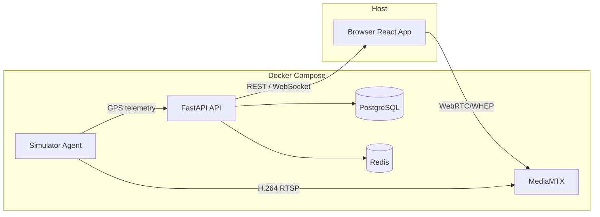

# Fleet Tracking Dashboard

A simulator-first fleet dashboard for vehicle tracking, live map positions, and H.264 video telematics via WebRTC/WHEP.

## Tech Stack

- **Backend:** Python 3.12, FastAPI, SQLAlchemy 2 (async), Alembic, Pydantic v2, pytest
- **Datastore:** PostgreSQL 16, Redis 7
- **Media:** MediaMTX (RTSP ingest, WebRTC/WHEP delivery)
- **Frontend:** Vite, React 18, TypeScript, TanStack Query, Leaflet, Tailwind CSS
- **Dev Agent:** Python asyncio, OpenCV, ffmpeg, aiohttp
- **Package Manager:** uv (backend), npm (frontend)

## Prerequisites

- Docker Engine 24+ and Docker Compose v2
- Node.js 18+ and npm (for local frontend development)
- Git
- Optional: a webcam for real video passthrough; otherwise the simulator renders a test pattern

## Quick Start

```bash
git clone <repository-url>
cd "fleet management"
make up
make migrate
make seed
```

If the `Makefile` is not present yet, use Docker Compose directly:

```bash
docker compose up -d --build db redis mediamtx api
# run migrations and seed inside the api container
docker compose exec api alembic upgrade head
docker compose exec api python -m app.seed
```

Start the frontend dev server:

```bash
cd frontend
npm install
npm run dev
```

## Access URLs

| Service | URL |
|---|---|
| Frontend dashboard | http://localhost:5173 |
| FastAPI API | http://localhost:8000 |
| API health | http://localhost:8000/health |
| MediaMTX control API | http://localhost:8889 |
| MediaMTX WebRTC/WHEP | http://localhost:8890 |

## Default Login

- **Username:** `admin`
- **Password:** `admin`

After logging in you are redirected to `/dashboard/vehicles`.

## Architecture Overview



Responsibilities:

- **FastAPI API** owns the domain model, REST endpoints, JWT auth, and the Redis-backed `/ws/fleet/positions` fan-out.
- **PostgreSQL** stores vehicles, devices, channels, telemetry, recordings, and the latest vehicle state.
- **Redis** holds `fleet:latest` for fast position reads and `fleet:telemetry` pub/sub for WebSocket updates.
- **MediaMTX** ingests H.264 over RTSP and fans out WebRTC/WHEP streams to browsers.
- **Simulator** emits GPS telemetry and publishes live or test-pattern video for each configured device.

## Webcam Passthrough Caveat

On Windows and macOS, passing a host webcam into a Docker container is limited or unsupported by default. The simulator automatically falls back to a generated test pattern when no webcam is available, so the dashboard still shows live-looking video.

On Linux hosts with a V4L2 camera, you can enable passthrough by uncommenting the `devices` block in `docker-compose.yml`:

```yaml
simulator:
  devices:
    - /dev/video0:/dev/video0
```

## Seeding and Fault Injection

### Run the simulator

```bash
make simulator
```

Or directly with Docker Compose:

```bash
docker compose up -d simulator
```

The simulator reads `simulator/config.yaml` and starts one agent per device. It logs in as `admin`, emits GPS every 5 seconds, and publishes H.264 RTSP streams to MediaMTX.

### Fault injection flags

Faults can be set globally in `simulator/config.yaml` under `fault_injection`, or per-device, or via CLI flags:

| Flag | Effect |
|---|---|
| `--drop-frames` | Randomly drop ~5% of video frames |
| `--stall 20s` | Pause telemetry emission for the given duration |
| `--jitter` | Randomly vary the GPS interval by ±40% |
| `--disconnect-every 60s` | Disconnect and reconnect the video stream every N seconds |

Example:

```bash
docker compose exec simulator python supervisor.py --drop-frames --stall 20s --disconnect-every 60s
```

These flags let you exercise every video panel state (`idle`, `connecting`, `live`, `degraded`, `reconnecting`, `offline`) without a real vehicle.

## Testing

### Backend tests

```bash
make test
```

Or directly:

```bash
cd backend
uv run pytest -v
```

### End-to-end tests

```bash
make test-e2e
```

Or directly:

```bash
cd frontend
npm install
npx playwright install --with-deps
npx playwright test
```

> **Note:** Playwright config and E2E specs are part of Task 10 and may still be added.

## OSM Tile Demo-Only Note

The map uses OpenStreetMap public tile servers by default. This is acceptable for local development and demos only. Before any production or commercial deployment, switch to a licensed provider such as MapTiler, Stadia Maps, or a self-hosted tile server.

## Environment Variables

Backend variables are read from the environment or an optional `backend/.env` file.

| Variable | Default | Purpose |
|---|---|---|
| `DATABASE_URL` | `postgresql+asyncpg://fleet_user:fleet_pass@db:5432/fleet_db` | Async Postgres DSN |
| `REDIS_URL` | `redis://redis:6379/0` | Redis connection string |
| `SECRET_KEY` | `dev-secret-change-me` | JWT signing key |
| `ENV` | `dev` | Runtime profile; `dev` enables the ingest endpoint |
| `MEDIAMTX_HOST` | `mediamtx` | MediaMTX hostname inside Docker |
| `MEDIAMTX_RTSP_PORT` | `8554` | RTSP ingest port |
| `MEDIAMTX_HTTP_PORT` | `8890` | WHEP/WebRTC HTTP port |
| `MEDIAMTX_API_PORT` | `8889` | MediaMTX control API port |
| `DEV_DEVICE_KEY` | `dev-device-key` | Header key for `POST /api/dev/ingest/telemetry` |

## Project Layout

```
.
├── backend/              FastAPI app, models, migrations, tests
├── frontend/             Vite + React + TypeScript dashboard
├── simulator/            GPS + H.264 dev agent and supervisor
├── docs/                 PRD, architecture, and implementation plans
├── docker-compose.yml    All services
└── mediamtx.yml          MediaMTX configuration
```
