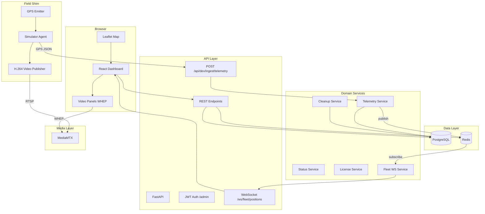

# Fleet Dashboard Architecture

This document describes the runtime architecture of the simulator-first fleet dashboard. It is the implementation reference for `docs/fleet-dashboard-prd-v2.md`.

## Component Diagram

## Data Flow

### Telemetry and Positions

1. The **simulator** generates a GPS fix every 5 seconds and `POST`s it to `POST /api/dev/ingest/telemetry` with `X-Device-Key`.
2. The **Telemetry Service** validates the fix, writes it to `telemetry_points` (partitioned by month), and upserts `vehicle_latest` with a server-derived status.
3. The service publishes the update to the Redis channel `fleet:telemetry` and refreshes the Redis hash `fleet:latest`.
4. The **Fleet WebSocket Service** subscribes to `fleet:telemetry` and broadcasts JSON to every connected browser via `/ws/fleet/positions`.
5. Browsers also poll `GET /api/fleet/positions` every 15 seconds as a fallback when the WebSocket is disconnected.

All fan-out goes through Redis so the system works with multiple Uvicorn workers. No in-process state is shared between ingest and delivery.

### REST Reads

- `GET /api/vehicles` and related CRUD come from PostgreSQL.
- `GET /api/fleet/positions` reads the `fleet:latest` Redis hash, then filters by `status`, free-text `q`, and `bbox`.
- `GET /api/devices/{id}/channels` and `GET /api/devices/{id}/health` combine PostgreSQL channel metadata with the MediaMTX control API.

## Video Flow

1. The simulator's `VideoPublisher` opens the first available webcam or falls back to a generated test pattern.
2. Raw BGR frames are piped to `ffmpeg`, encoded as H.264, and published over RTSP to MediaMTX at paths such as `device-1-ch1`.
3. The browser requests channel metadata from the API, which returns WHEP stream URLs such as `http://mediamtx:8890/device-1-ch1/whep`.
4. The browser loads the WHEP stream directly from MediaMTX; video never passes through FastAPI.
5. Health is polled every 3 seconds from `GET /api/devices/{id}/health`, which queries the MediaMTX API and Redis frame timestamps to drive the panel state machine.

## Data Model Summary

| Table | Purpose |
|---|---|
| `vehicles` | Vehicle registry: registration number, type, speed limit, license status and expiry. |
| `devices` | Device identity: serial, SIM, protocol, last seen timestamp. Links optionally to a vehicle. |
| `device_channels` | Per-device camera channels: channel number, label, MediaMTX stream path. |
| `device_sessions` | Connection history for debugging field devices. |
| `telemetry_points` | Append-only GPS fixes. Partitioned by month from day one. |
| `vehicle_latest` | One denormalized row per vehicle with the most recent fix and derived status. |
| `video_clips` | Server-side recordings: device, channel, start/end time, file path, size. |

Key design choices:

- `telemetry_points` is range-partitioned by `recorded_at` so old months can be dropped cheaply.
- `vehicle_latest` is the single source of truth for current status; the UI never computes it.
- Channels are a table because vehicle types differ (a bike has one camera; a truck may have two or more).

## Status Derivation Rules

Server-side only, in `backend/app/services/status_service.py`:

| Status | Rule | UI Label |
|---|---|---|
| `moving` | Fix < 60s old and speed > 3 km/h | Running |
| `standing` | Fix < 60s old and speed ≤ 3 km/h | Stationary |
| `stale` | Fix between 60s and 15min old | Stale |
| `offline` | Fix > 15min old, or never received | Offline |

License "Needs Renewal" is `True` when the license is expired or expires within 30 days.

## Scaling Notes

The current design targets ≤ 50 vehicles and ≤ 5 concurrent viewers with ≤ 4 simultaneous video panels.

To move toward 500 vehicles:

- **Telemetry partitioning:** Already partitioned by month; drop old partitions for the 90-day retention policy.
- **Redis fan-out:** The WebSocket service already subscribes to a single Redis pub/sub channel. At higher scale, shard by region or vehicle group.
- **BBox-bound queries:** `GET /api/fleet/positions` accepts `bbox=sw_lat,sw_lon,ne_lat,ne_lon` so the map only fetches visible vehicles.
- **Marker clustering:** Add Leaflet marker clustering on the frontend when hundreds of markers overlap.
- **Worker count:** Scale Uvicorn workers horizontally; Redis pub/sub keeps fan-out consistent across workers.
- **Video bitrate:** The simulator caps each channel at 500 kbps. Field DVRs should publish the low-bitrate sub-stream (~0.3–0.5 Mbps), never the main stream.

## Security Notes

- **Single hardcoded user:** `admin` / `admin`. JWT tokens expire after 24 hours. This is acceptable for demos and local development only.
- **Dev-only ingest:** `POST /api/dev/ingest/telemetry` is guarded by `X-Device-Key` and is intended only for the simulator. Real DVRs will push binary telemetry over TCP to a separate protocol adapter, not over HTTP.
- **MediaMTX is open:** `mediamtx.yml` allows publish/read/playback from any IP for local development. Lock this down with authentication before any deployment.
- **CORS:** The API allows all origins in development. Restrict this in production.
- **Secrets:** `SECRET_KEY` and `DEV_DEVICE_KEY` default to development values. Rotate them before any real deployment.
